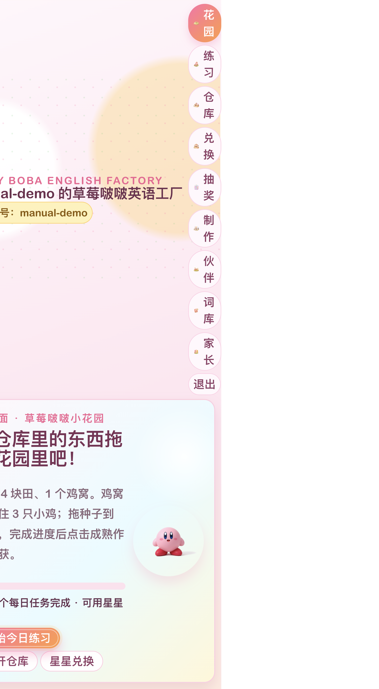
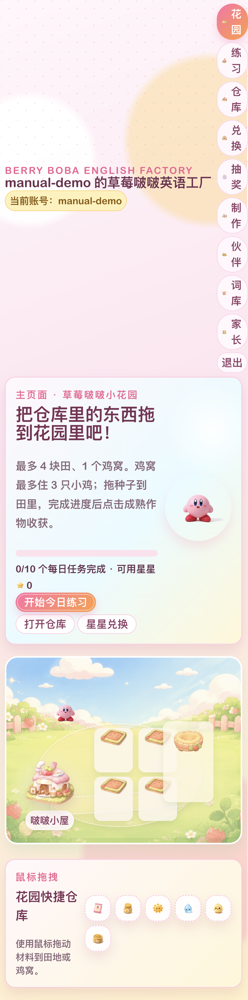
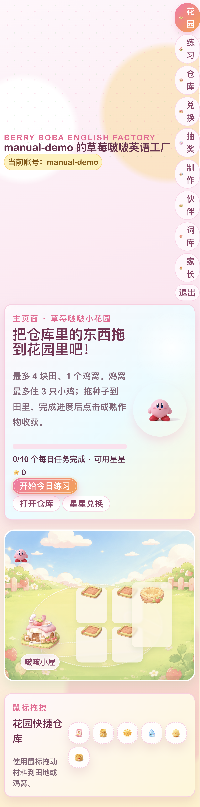
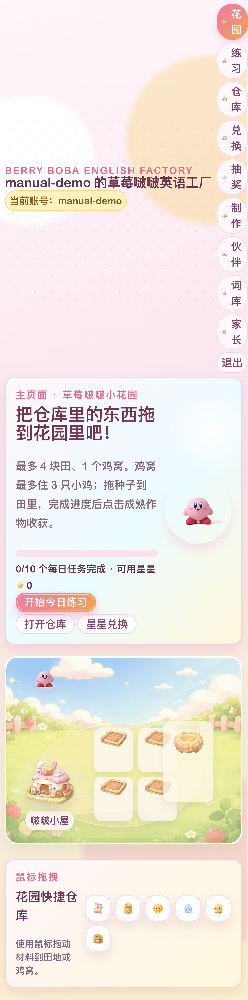
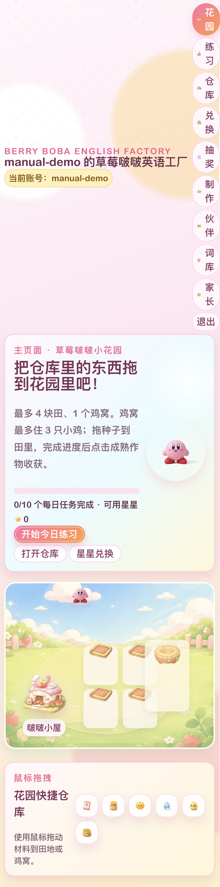
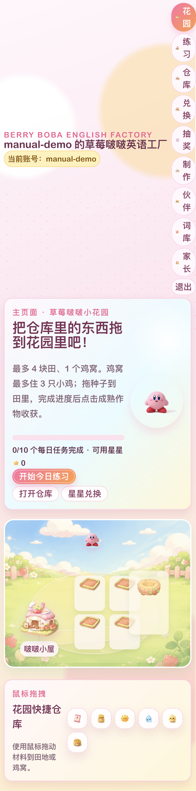

# 草莓啵啵英语工厂使用说明书

> 本说明书适用于当前 Vite + React 版本的 **Berry English Quest / 草莓啵啵英语工厂**。游戏数据保存在本机浏览器中，适合儿童每日进行英语口语练习、收集材料、经营花园与制作甜品。

## 1. 游戏简介

草莓啵啵英语工厂把英语口语练习和轻量经营玩法结合在一起：

- 每天完成 10 个英语练习任务。
- 每题最高获得 3 颗星，每日最高 30 颗星。
- 星星可用于兑换种子、阳光、雨露、鸡食料等资源。
- 每满 10 颗今日练习星星可抽奖 1 次，每天最多 3 次。
- 在花园种植草莓、小麦，喂养小鸡获得鸡蛋。
- 在工厂制作面粉、珍珠、草莓啵啵和蛋挞。
- 通过制作高级道具积累招待点，逐步解锁伙伴。

---

## 2. 登录与账号

1. 打开游戏页面。
2. 输入账号和密码。
3. 点击 **登录 / 创建账号**。
4. 如果账号不存在，系统会在本机浏览器中创建一个新账号。

> 注意：当前版本主要使用浏览器本地存储。换浏览器、清理浏览器数据或更换设备后，原数据可能不可见。建议家长定期在家长面板查看和备份学习进度。

---

## 3. 首页与花园

首页展示当前账号、今日进度、每日任务完成数量、可用星星、主导航和花园区域。

### 花园主要操作

- 把快捷仓库中的物品拖到花园格子中使用。
- 草莓种子可种出草莓。
- 小麦种子可种出小麦。
- 小鸡可放入鸡窝。
- 阳光和雨露用于照料作物。
- 鸡食料用于喂养小鸡。

### 初始资源

新账号初始拥有：

| 资源 | 数量 |
| --- | ---: |
| 阳光 | 1 |
| 雨露 | 1 |
| 鸡食料 | 1 |
| 草莓种子 | 1 |
| 小麦种子 | 1 |
| 小鸡 | 1 |

### 成熟规则

| 对象 | 成熟 / 产出条件 | 收获结果 |
| --- | --- | --- |
| 草莓 | 阳光 2 次 + 雨露 2 次 | 草莓 x1 |
| 小麦 | 阳光 2 次 + 雨露 2 次 | 小麦 x1 |
| 小鸡 | 鸡食料逐步喂养 | 鸡蛋 x1 |

---

## 4. 每日练习

点击顶部导航中的 **练习** 进入每日英语任务。

### 练习规则

- 每天有 10 个口语任务。
- 每个任务根据完成情况获得星星。
- 每题最高 3 星。
- 每天最高可获得 30 星。
- 星星会进入可用星星账户，可用于兑换资源。

建议使用方式：

1. 每天先完成练习任务。
2. 用获得的星星兑换花园资源。
3. 使用今日星星抽奖。
4. 回到花园种植、喂鸡和制作。

---

## 5. 抽奖系统

点击 **抽奖** 进入每日抽奖页面。

### 抽奖次数规则

| 今日练习获得星星 | 可抽奖次数 |
| ---: | ---: |
| 0 - 9 | 0 次 |
| 10 - 19 | 1 次 |
| 20 - 29 | 2 次 |
| 30 及以上 | 3 次 |

实现规则：

- 今日练习星星每满 10 星获得 1 次抽奖。
- 每日最多 3 次。
- 抽奖次数以当天任务进度为准。
- 已领取次数会记录在当天任务中。

### 掉落概率分布

当前掉落表总权重为 100，因此权重值可直接理解为长期概率百分比。

| 奖励 | 数量 | 权重 | 概率 |
| --- | ---: | ---: | ---: |
| 草莓种子 | 1 | 22 | 22% |
| 小麦种子 | 1 | 18 | 18% |
| 阳光 | 1 | 16 | 16% |
| 雨露 | 1 | 16 | 16% |
| 鸡食料 | 1 | 10 | 10% |
| 珍珠 | 1 | 6 | 6% |
| 茶底 | 1 | 5 | 5% |
| 牛奶 | 1 | 4 | 4% |
| 小鸡 | 1 | 1 | 1% |
| 星星 | 3 | 2 | 2% |
| **合计** |  | **100** | **100%** |

### 概率说明

- 概率代表长期统计趋势，单次抽奖结果可能有波动。
- 道具奖励会加入仓库。
- 星星奖励会增加可用星星和累计星星。
- 当前抽奖使用基于日期、已领取次数、学习结果数量和总星星的种子随机逻辑，同一状态下结果更容易复现。

---

## 6. 工厂制作

点击 **制作** 进入工厂页面。工厂用于把基础材料加工成高级道具。

### 制作配方

| 配方 | 消耗材料 | 产出 | 招待点 |
| --- | --- | --- | ---: |
| 磨面粉 | 小麦 x1 | 面粉 x1 | 0 |
| 搓珍珠 | 面粉 x1 | 珍珠 x1 | 0 |
| 草莓啵啵 | 草莓 x2 + 珍珠 x1 + 茶底 x1 + 牛奶 x1 | 草莓啵啵 x1 | +1 |
| 蛋挞 | 鸡蛋 x2 + 面粉 x1 + 牛奶 x1 | 蛋挞 x1 | +1 |

### 制作建议

- 优先种小麦，用小麦制作面粉。
- 面粉既可继续做珍珠，也可用于蛋挞。
- 草莓啵啵需要茶底和牛奶，这两种材料主要来自抽奖。
- 高级道具能增加招待点，用于伙伴解锁。

---

## 7. 仓库

点击 **仓库** 查看当前所有资源。

仓库资源大致分为：

- 养成资源：阳光、雨露、鸡食料。
- 种子：草莓种子、小麦种子。
- 动物：小鸡。
- 农作物：草莓、小麦。
- 加工品：面粉、珍珠。
- 工厂材料：茶底、牛奶等。
- 高级道具：草莓啵啵、蛋挞。

---

## 8. 星星兑换

点击顶部导航中的 **兑换** 可进入星星商店。商店可用练习获得的星星购买资源。

| 商品 | 价格 |
| --- | ---: |
| 阳光 | 2 星 |
| 雨露 | 2 星 |
| 鸡食料 | 3 星 |
| 小麦种子 | 3 星 |
| 草莓种子 | 4 星 |
| 草莓 | 12 星 |
| 小鸡 | 20 星 |

建议优先兑换：

1. 阳光、雨露：用于作物成熟。
2. 小麦种子：用于制作面粉和珍珠。
3. 鸡食料：用于获得鸡蛋。
4. 缺少高级配方材料时，再结合抽奖补齐。

---

## 9. 伙伴解锁

伙伴通过招待点解锁。制作草莓啵啵或蛋挞等高级道具可以获得招待点。

| 伙伴阶段 | 需要招待点 |
| --- | ---: |
| 初始伙伴 | 0 |
| 第二位伙伴 | 10 |
| 第三位伙伴 | 20 |
| 第四位伙伴 | 30 |

> 当前界面显示的伙伴名称和图片以游戏内页面为准。

---

## 10. 词库

点击 **词库** 可查看练习中出现的英语词汇和表达。建议家长配合孩子复习：

- 每天练习前先浏览词库。
- 对不熟悉的词做重点朗读。
- 练习后再次回看，巩固发音和含义。

---

## 11. 家长面板

点击 **家长** 进入家长面板。

家长可以重点关注：

- 今日任务完成情况。
- 累计星星数量。
- 仓库和制作进度。
- 孩子是否持续完成每日练习。

建议家长每周查看一次学习情况，并鼓励孩子把星星用于合理的资源规划。

---

## 12. 推荐每日流程

1. 登录账号。
2. 进入 **练习**，完成当天 10 个英语任务。
3. 查看获得星星。
4. 进入 **抽奖**，领取可用抽奖次数。
5. 进入 **兑换**，补充阳光、雨露、种子或鸡食料。
6. 回到 **花园**，种植、照料、喂鸡和收获。
7. 进入 **制作**，加工材料并制作高级道具。
8. 查看 **伙伴** 和 **家长** 页面确认进度。

---

## 13. 常见问题

### 为什么今天不能抽奖？

需要今日练习星星达到 10 星才有 1 次抽奖机会。每天最多 3 次。

### 为什么作物还不能收获？

草莓和小麦需要分别获得 2 次阳光和 2 次雨露后才能成熟。

### 为什么不能制作某个配方？

仓库中材料不足时不能制作。请先种植、收获、抽奖或兑换资源。

### 为什么换设备后账号数据不见了？

当前版本主要依赖浏览器本地保存，不是云端账号系统。请尽量在同一设备和浏览器中使用。

### 抽奖概率是否等于每次必然按比例掉落？

不是。概率是长期统计分布，单次抽奖可能连续获得同类道具，也可能很久才获得稀有道具。
